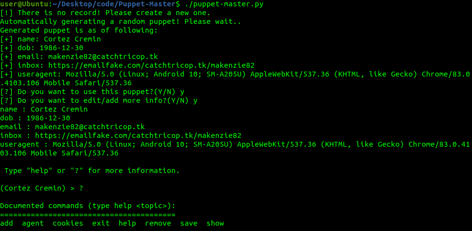
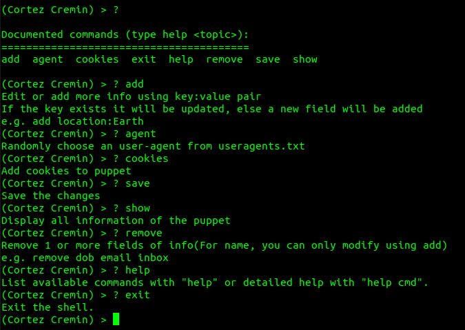
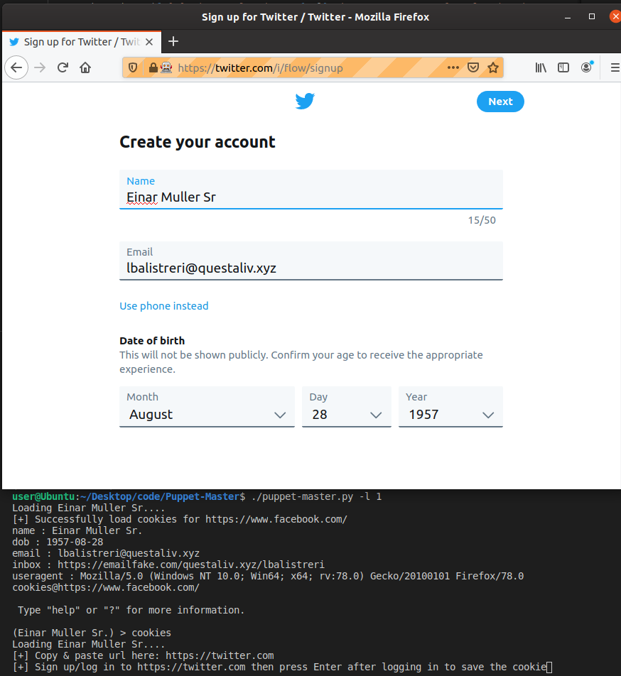
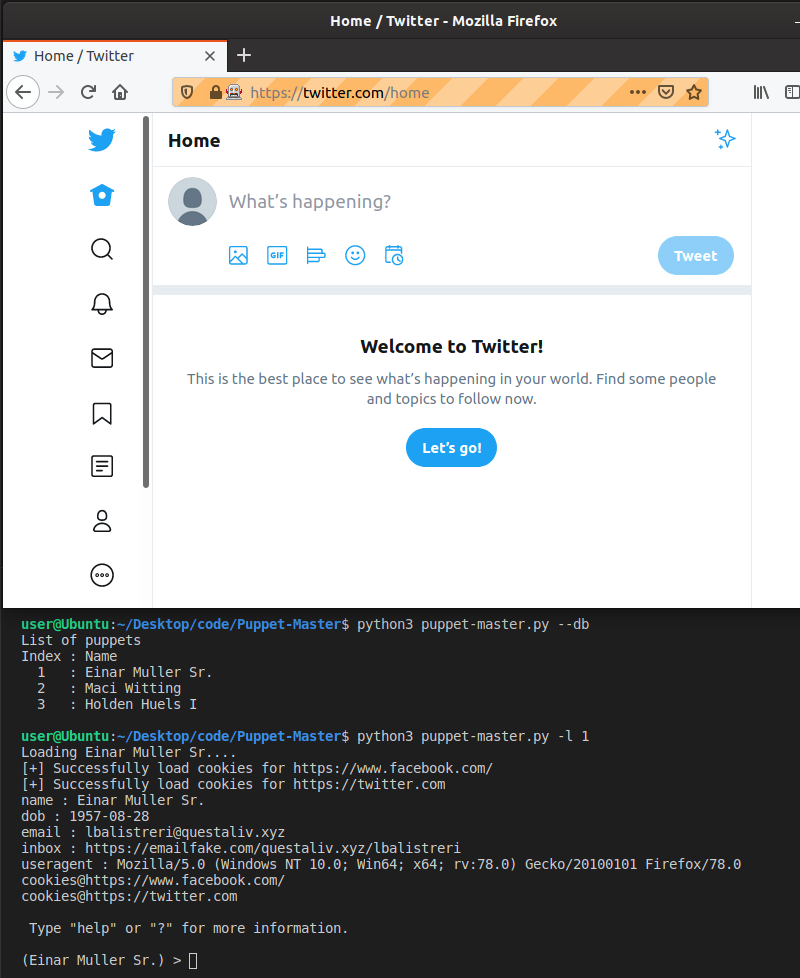

# Puppet-Master

Efficently and effortlessly create, maintain, re-use sock puppets for OSINT investigations and anonymity in a consistent fashion.

TODO 
- Location and timezone services.
- Keep track of the age of puppets.
- Add browser extensions.
## Purpose 
- The goal of this project is to help OSINT investigators to easily create and store sock puppets. This script can automatically and consistently prepare their browser and system accordingly to each puppet based on stored information.
- The idea was inspired by [this talk](https://www.youtube.com/watch?v=v8EP6xOcB8M) by Zhuang Weiliang @egomy_cs - I highly recommend to watch it.
- This script automates some parts of it and reduces the hassle of keeping track, managing puppets and their information.
- It aims to keep puppet's activities as consistent as possible.
## Requirements 
- [Python 3.x.x](https://www.python.org/downloads/)
- [Firefox](https://www.mozilla.org/en-CA/firefox/all/#product-desktop-release) 
- [geckodriver](https://github.com/mozilla/geckodriver/releases)
## Install
Download and install Python3, Firefox and geckodriver (geckodriver must be put in Path)
<pre><code>
git clone https://github.com/Anh-V-N/Puppet-Master.git
cd Puppet-Master
python3 pip -r requirements.txt
</code></pre>

## Features
- Automatically or manually create new puppet profiles
- Edit/add puppet's information as needed
- Cookies added to puppet profile will be loaded automatically everytime you load the puppet
- Easily maintain and manage multiple puppets

<pre><code>
user@Ubuntu:~/Desktop/code/Puppet-Master$ ./puppet-master.py -h
usage: puppet-master.py [-h] [-i] [-r] [-db] [-m index] [-v index] [-d index]
                        [-l index]

Specify an optional argument with the index corresponding to a puppet to
interact with it

optional arguments:
  -h, --help      show this help message and exit
  -i, --init      Set up new puppet
  -r, --random    Generate a random puppet
  --db            List the puppets and their corresponding index
  -m index        Modify infomation of a puppet
  -v index        View infomation of a puppet
  --remove index  Remove a puppet
  -l index        Load a puppet
</code></pre>
## What is a sock puppet?
It is an online identity that is not supposed to lead back to you.
## How does it work?
### Creating sock puppet
- There are two ways to create puppets, either by randomly generating using -r or inputing the puppet information manually using -i. Randomized puppet's basic information such as name, date of birth is pulled from namefake.com api. This api also provide an randomized email address and its non-password inbox from namefake.com that lasts for 70+ days. 
- Note: I have tried to used this email address to register accounts on some social media sites including facebook and twitter and it worked. However, this can change at any point.
- Updated: facebook seems to have caught up with this.
- Puppet's browser useragent is randomly pulled from useragents.txt, I have included some of the well-known useragents in this text file and you can modify accordingly to your liking.
### Storing sock puppets
- Saved puppet's information are stored in json format in folder ./Puppets under format puppet's name.json
### Using puppet
Before starting to use a puppet, you need to know its corresponding index. Each puppet is assigned an index number. To view the index: <pre><code> python3 puppet-master.py -db </code></pre>
Load a specific puppet
<pre><code> python3 puppet-master.py -l index </code></pre>
It will take a few seconds for the script to prepare the browser according to puppet's stored information(user-agent and cookies). Once the browser is ready, the script will enter editing mode.
### Modifying puppet
- Either load the puppet or run the script with -m to enter editing mode.
<pre><code> python3 puppet-master.py -l index </code></pre>
You can add/modify information by command add <key:value> 
- If the key exists it will be updated, else a new field will be added e.g. add location:Earth
### Adding cookies to puppets
In editing mode, type cookies.A new instance of firefox will be initiated. Simply navigate to the site, copy and paste the url to the prompt then sign up/log in. After loging in, press enter in the prompt and the script will collect the cookies.

## Screenshots

